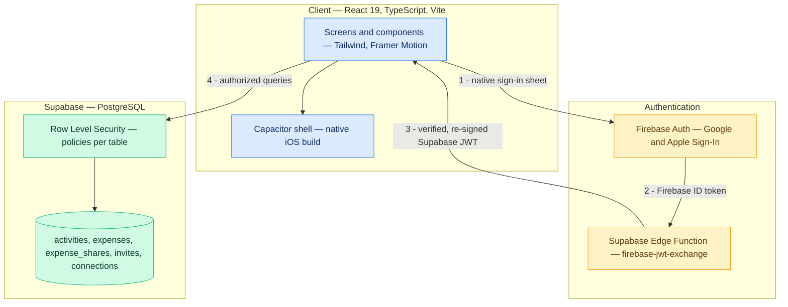
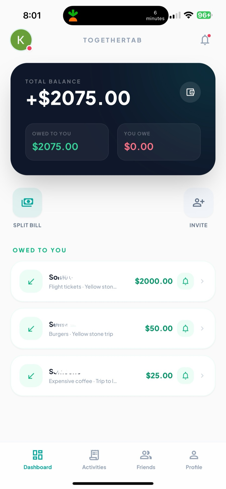
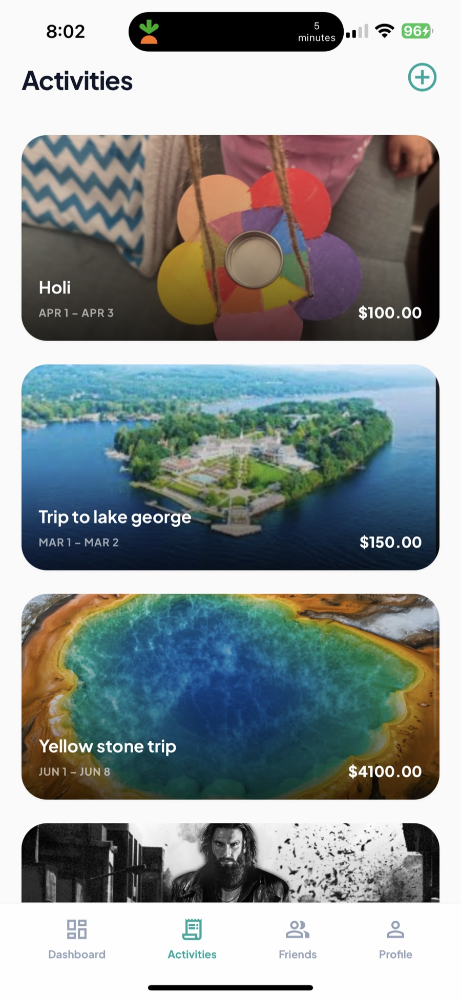
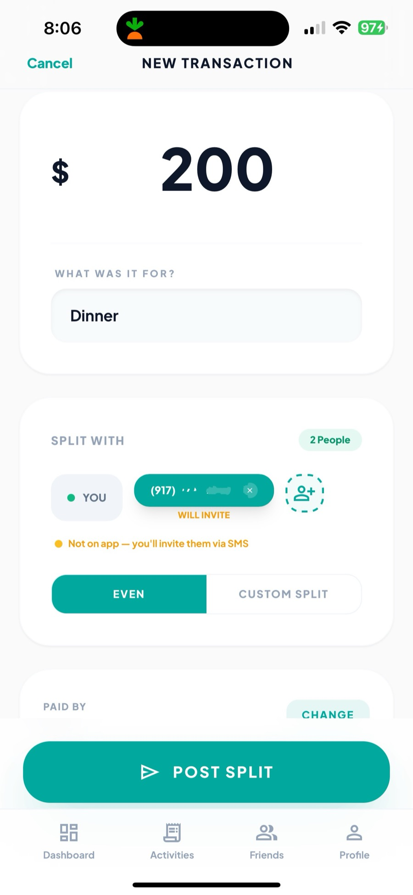
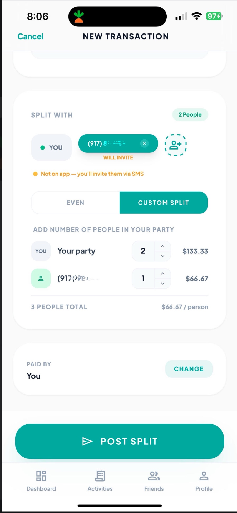
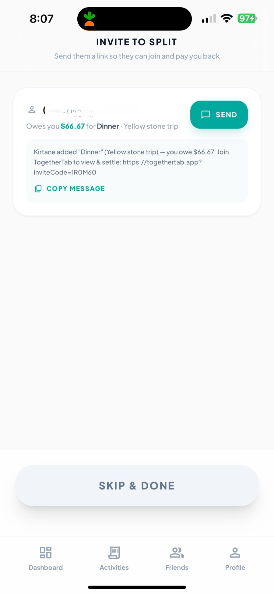
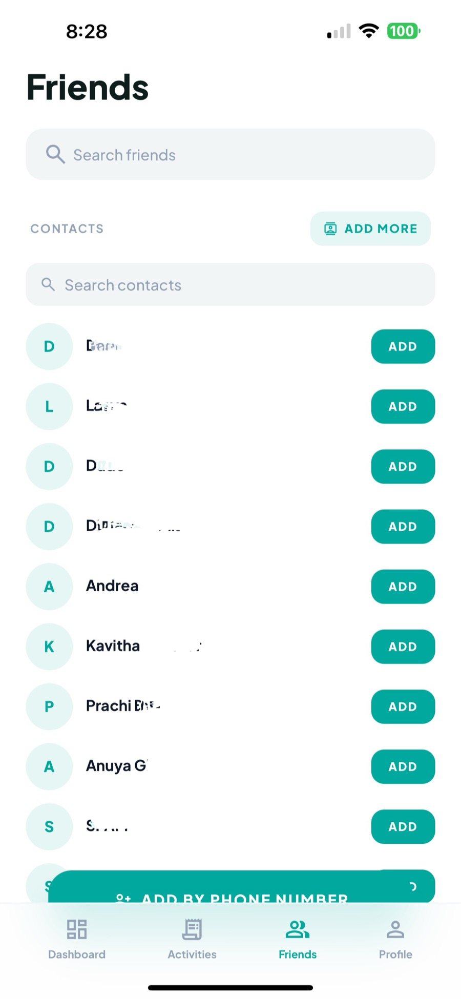
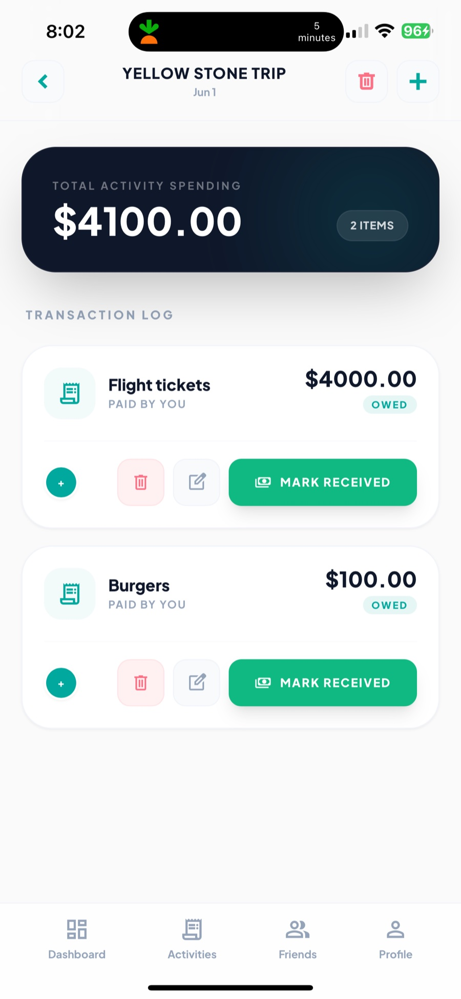

# TogetherTab

**Split bills with friends — no awkward IOUs.**

A mobile-first expense splitting app for tracking shared costs, whether it's a trip, a dinner, or any group expense. It runs in any browser but is built to feel like a native iOS app, and ships to the App Store through Capacitor.

`React 19` `TypeScript` `Tailwind` `Framer Motion` `Firebase Auth` `Supabase` `Capacitor` `iOS`

---

## The problem

Every bill-splitting app assumes the person you're splitting with already has the app. That assumption breaks on the first real dinner. Someone at the table hasn't installed it, doesn't want to, and now the whole group falls back to mental arithmetic and a promise to sort it out later.

TogetherTab treats that as the core case rather than the edge case. You can split with someone who has never heard of the app: they get an SMS with a link, and their share is waiting for them if they ever sign up. Nobody has to install anything for the split to be recorded correctly.

The second assumption worth breaking is that a split is one share per person. In practice one person often covers a partner, a kid, or a friend who left early — so shares are allocated by party size, not headcount.

---

## Architecture

The interesting problem here is authentication. I wanted Firebase's native Google and Apple sign-in sheets on iOS — they're the ones users already trust, and they avoid showing a backend URL during login. But I wanted Supabase Postgres for data, with Row Level Security enforcing access at the database layer rather than in application code.

Those two don't talk to each other. Supabase RLS policies expect a Supabase-issued JWT; Firebase issues its own. The bridge is a Supabase Edge Function that verifies the Firebase token and mints a Supabase-compatible JWT in exchange. RLS then works normally, and every query is authorized by the database itself.

**Why it's built this way**

| Decision | Reasoning |
|---|---|
| Firebase Auth over Supabase Auth | Native Google and Apple sign-in sheets on iOS, with no backend URL surfaced to the user during login. |
| Supabase Postgres over Firestore | Expense splitting is relational — expenses fan out to shares, shares link to users or pending invites. Joins and constraints matter more than document flexibility. |
| RLS over application-layer checks | Authorization lives with the data. A missed check in UI code can't leak another group's expenses. |
| Edge Function JWT bridge | The one piece of custom infrastructure, and it exists solely to let the two previous decisions coexist. |
| Capacitor over React Native | One codebase ships as both a web app and a native iOS app, with no separate mobile implementation to maintain. |

**Data model.** `activities` group `expenses`; each expense fans out into `expense_shares` recording who owes what. A share can point at a registered user *or* at a pending `invite`, which is what lets you split with someone who isn't on the app yet — when they claim the invite code, the existing share is reassigned to their new account rather than recreated.

---

## Screens

### Dashboard and activities

Net balance at a glance, separated into what you're owed and what you owe, with a reminder bell on each outstanding item. Expenses are grouped into activities — trips, events, dinners — each with a cover photo and running total.

<table>
  <tr>
    <td width="50%"></td>
    <td width="50%"></td>
  </tr>
</table>

### Splitting a bill

Enter the amount and what it was for, then choose participants. **Even** divides equally. **Custom split** allocates by party size — the "I'm covering my partner and kid" case that a straight headcount gets wrong. Totals recalculate live as counts change.

<table>
  <tr>
    <td width="50%"></td>
    <td width="50%"></td>
  </tr>
</table>

### Reaching people who aren't on the app

Participants who aren't registered are flagged inline as *will invite*. After posting the split, the app generates a pre-composed SMS with a deep link carrying an invite code. Friends can be added from your contacts or by phone number, with real-time lookup detecting existing users.

<table>
  <tr>
    <td width="50%"></td>
    <td width="50%"></td>
  </tr>
</table>

### Settling up

Each activity keeps a full transaction log. The payer marks an expense received and it settles immediately; once every expense in an activity is settled, the activity archives itself rather than lingering in the list.

<table>
  <tr>
    <td width="50%"></td>
    <td width="50%"></td>
  </tr>
</table>

---

*Source is private. Happy to walk through the implementation — [reach me on LinkedIn](https://www.linkedin.com/in/prachibhopatkar).*
